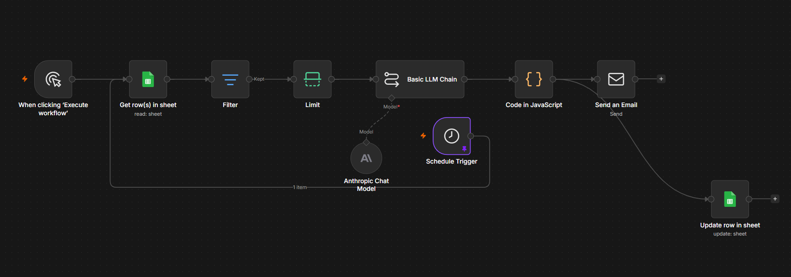
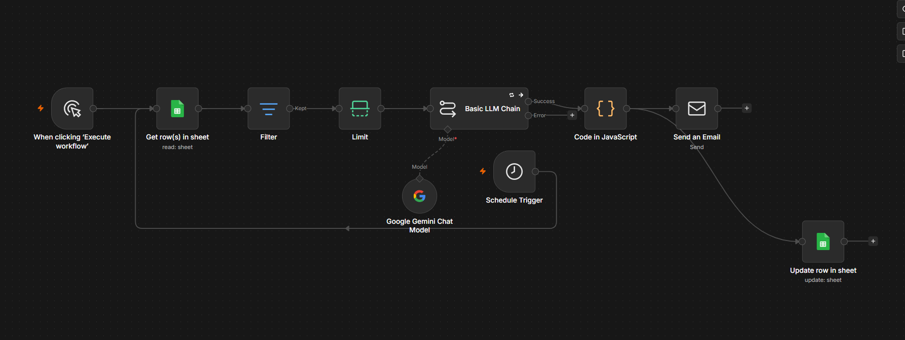
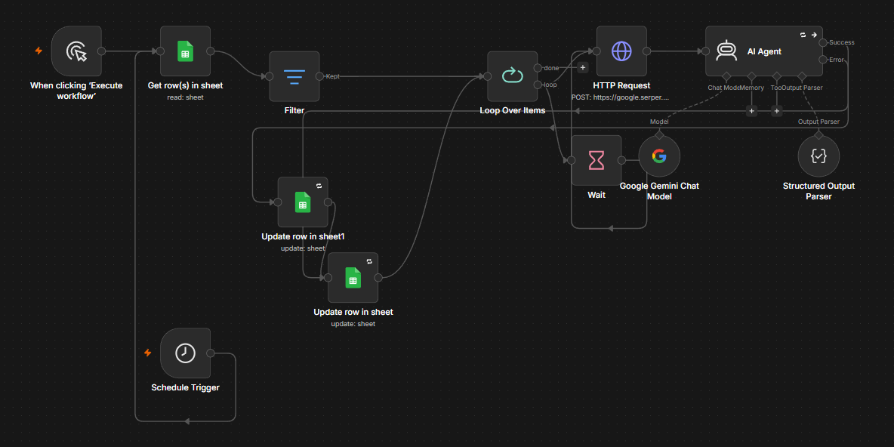
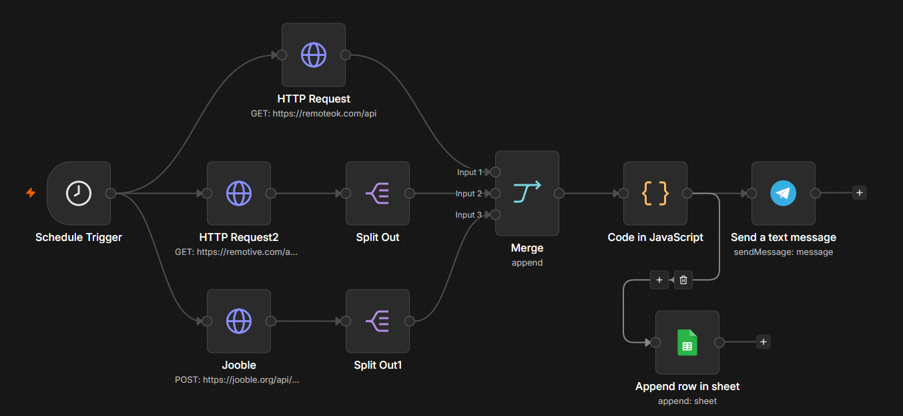

# 👋 Hola, soy Jorge Hernández

💻 Backend Developer (NestJS) | Full Stack Developer 🚀 Enfocado en construir APIs escalables y sistemas reales

---

## 🧠 Sobre mí

Soy desarrollador de software con 10 años de experiencia profesional, especializado en backend: creación de APIs robustas y arquitecturas escalables.

Trabajo principalmente con NestJS, TypeORM y PostgreSQL, aplicando buenas prácticas de desarrollo, control de versiones y diseño modular. También automatizo procesos y flujos de trabajo con n8n.

Actualmente estoy enfocado en mejorar mis habilidades en arquitectura de software, backend escalable, microservicios, optimización de bases de datos y automatización de procesos con n8n.

---

## ⚙️ Stack Tecnológico

### 🔹 Backend
NestJS, Node.js, TypeORM, Express

### 🔹 Base de datos
PostgreSQL, MySQL, MongoDB

### 🔹 Frontend
Next.js, JavaScript, HTML5, CSS3, Tailwind CSS

### 🔹 Automatización
n8n (flujos de integración y automatización de procesos)

### 🔹 Herramientas
Git & GitHub, REST APIs, Postman, Cloudinary

---

## 🚀 Proyectos Destacados

### 🤝 DevMatch
🧩 Plataforma para conectar talento tecnológico con oportunidades laborales mediante análisis de habilidades, procesamiento de vacantes y matching automatizado.

🔧 Tecnologías: NestJS · Next.js · PostgreSQL · TypeScript

👉 Repositorio: [https://github.com/JorgeHernandez-code/DevMatch](https://github.com/JorgeHernandez-code/DevMatch)

### 🤖 NeuroPlay
🧩 Demo de generación de leads con IA para negocios de servicios técnicos: quiz interactivo que califica visitantes (hot/warm/cold) y chat de FAQ 24/7.

🔧 Tecnologías: Python · FastAPI · SQLAlchemy

👉 Repositorio: [https://github.com/JorgeHernandez-code/NeuroPlay](https://github.com/JorgeHernandez-code/NeuroPlay)

### 🔐 GoSafe API
🧩 API REST construida con NestJS enfocada en autenticación, roles y arquitectura modular.

🔧 Tecnologías: NestJS · TypeORM · PostgreSQL · JWT

⚡ Funcionalidades: autenticación con JWT, sistema de roles y permisos, arquitectura modular escalable y trabajo en equipo con GitFlow.

👉 Demo / Documentación: [https://gosafe-seven.vercel.app/](https://gosafe-seven.vercel.app/)

### 🧵 BordadosChileApp
📊 Sistema de gestión completo para negocio real con facturación y control de pedidos.

🔧 Tecnologías: C# · SQL Server · Windows Forms

👉 Repositorio: [https://github.com/JorgeHernandez-code/BordadosChileApp](https://github.com/JorgeHernandez-code/BordadosChileApp)

---

## 🤖 Automatizaciones con n8n

Además de desarrollo backend, diseño y mantengo flujos de automatización en producción para negocios reales, conectando formularios, bases de datos, IA y mensajería.

### 📩 Trendencia — Comunicación automática con leads
Flujo que lee nuevos leads desde Google Sheets, los filtra y limita, genera una respuesta personalizada con un modelo de IA (Anthropic) y envía el correo, actualizando el estado en la hoja. Incluye también un disparador programado (Schedule Trigger).

### 🏢 GDO Chile — Gestión y comunicación
Automatización de seguimiento y comunicación para GDO Chile: centraliza datos, aplica lógica de negocio y mantiene actualizada la información entre sistemas.

### 🔎 Enriquecimiento de base de datos GDO
Flujo que enriquece automáticamente los registros de la base de datos de GDO con información adicional, mejorando la calidad de los datos para su uso en otros procesos.

### 📲 Job Hunter — Vacantes a Telegram
Bot que busca automáticamente nuevas vacantes (RemoteOK, Remotive, Jooble) según criterios definidos, las combina, filtra duplicados y me las envía por Telegram para revisarlas al instante.

---

## 📈 Actualmente trabajando en

Mejora de arquitectura backend con NestJS, implementación de buenas prácticas (clean code, modularidad), automatización de procesos de negocio con n8n y desarrollo de proyectos orientados a negocio real.

## 🤝 Trabajo en equipo

Experiencia trabajando en entornos colaborativos utilizando GitFlow, Pull Requests, resolución de conflictos y desarrollo en equipo.

---

## 📫 Contacto

💼 LinkedIn: https://www.linkedin.com/in/jorge-hernandez-torres-71022876/

📧 Email: jorgehernandeztorres95@gmail.com

## 🚀 Objetivo profesional

Busco oportunidades como Backend Developer / Full Stack Developer en Colombia y LatAm, donde pueda aportar valor, seguir aprendiendo y participar en el desarrollo de sistemas reales y escalables.
